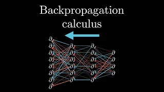
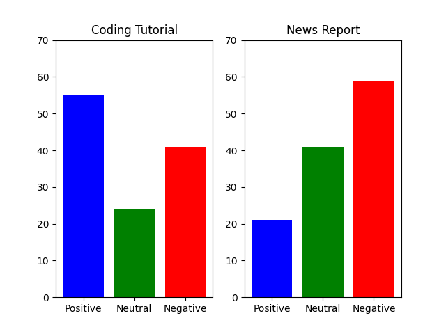
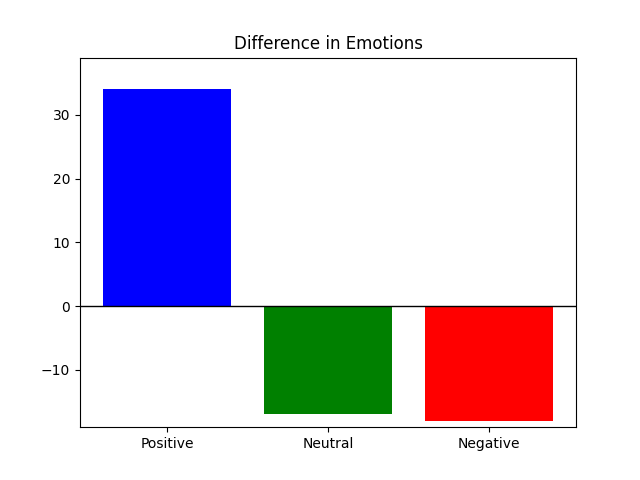
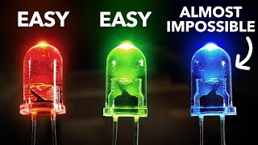

# User Sentiment Analysis Project

### This project uses Tweets that have been pre-labeled with user sentiment in order to create a SVM model for predicting user sentiment on future internet discussion.

## Sections of the project
- Model training
- Prediction of text using the model
- Collection of social media comments
- Formatting, cleaning, and storing the comments in a CSV file
- Using the model to analyze and give a distribution of sentiment
- Display comparative sentiments using charts

# How the Predictions work

### Creating the model
The train_model.py file handles the creation and storing of the model. It first loads the dataset from a CSV file. It then preprocesses the data by removing any missisng values and duplicates. 

The data is then split into training and testing sets. The text is converted in numerical features using TF-IDF. The SVM model is then trained with these numerical features to identify text sentiment. 

The trained SVM model and the TF-IDF vectorizer and then saved to the disk for future use. 

### Predicting text

Using the SVM model and Vectorizer the predict.py class is able to take text input and give a value of either 'Positive', 'Negative', or 'Neutral'

The Analyze.py file is then able to loop through any data set and give overall sentiment from multiple text inputs

Ex: The average sentiment or sentiment distribution of a Youtube comment section on a news story

# Example of my Comparative Algorithm

One use of algorithms I created to predict and analyze data is comparing the sentiment of two youtube video. Below are two videos I used as data sets. 

## Example Comments

| author               | updated_at            | like_count | text                                                                 | True   |
|----------------------|-----------------------|------------|----------------------------------------------------------------------|--------|
| @michaelzauzig5592 | 2023-09-29T19:09:55Z | 2        | "these videos are just superb. thanks so much for making them" | True |
| @johnduff2159 | 2024-03-01T21:18:53Z | 2        | "liiiiiaars!!!!" | True |

From the two youtube comment sections I collected 120 comments that fit the criteria for useable data
- Over the length of 10 characters. Without this comments like "Yes" or "Wow" were suprisingly common
- Has a like count over 2. This helped remove comments that appeared closer to spam than meaningful interaction 

After this the comments were cleaned of new lines and unusable characters so they could be properly interprented by the model. The model did allow for emojis as these are commonly used to distinguish sentiment on twitter. 

## Displaying Data

Below is a graph of sentiment distribution for the two videos, using the main.py function 

The data can also easily be changed into the difference in sentiment can be displayed on a bar graph

## Viewing Trends

A secondary use of the model can be to view how sentiment can change over time. I did this by create sentiment totals for a time period, where the numbers is added or subtracted depending on sentiment. 

I also used these data points to create a line of best fit to predict how the sentiment may continue to change in the future. 

The example below shows the trend for this youtube video

